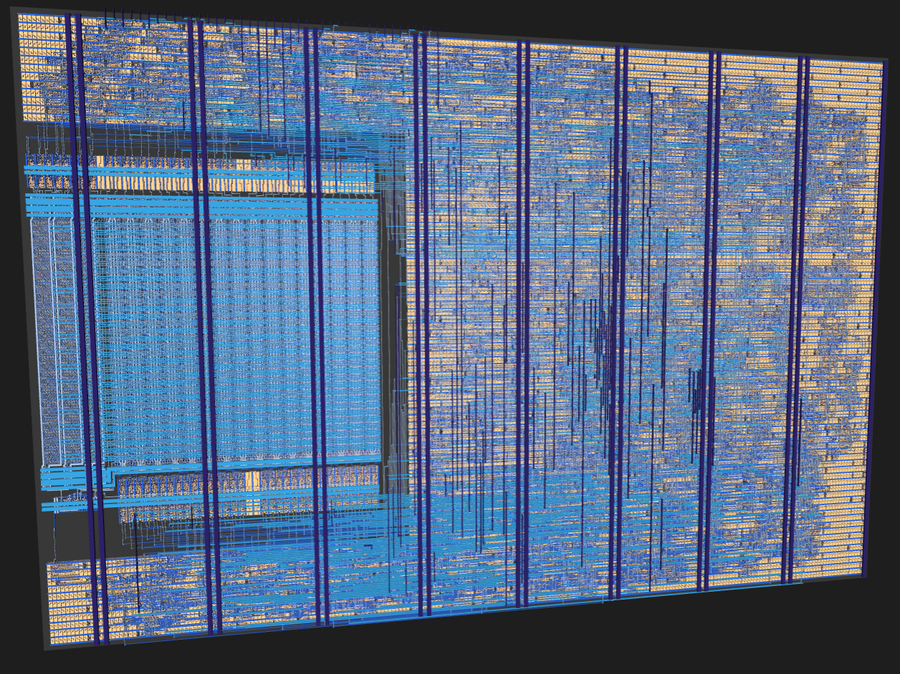

# HADES: Hamming-Aware Decode, Execute, and Search

[](../../actions/workflows/gds.yaml) [](../../actions/workflows/test.yaml) [](../../actions/workflows/docs.yaml)

HADES is a small processing-near-memory (PNM) engine for masked binary similarity search, built for Tiny Tapeout (SKY130, `ttsky26d`, 2x2 tiles).
The data rows sit in an on-chip register file and the compute logic next to it scans them in place, so only results leave the chip. A host loads a
16-bit-instruction program (32 slots) and up to 16 rows of 32 bits. The engine then computes Hamming distance (top-2, threshold bitmap, exact match)
and OR/AND/popcount reductions over the rows and streams the results back over an 8-bit port.

See [docs/info.md](docs/info.md) for the architecture, pins, instruction set and how to use the chip.



> HADES GDSII render

## Layout
| Path | Contents |
|---|---|
| `src-veryl/` | Veryl RTL sources (run `veryl build` after editing) |
| `src/` | generated SystemVerilog, wrapper `tt_um_hades.v` and the `rf_top` macro (committed, CI does not run Veryl) |
| `test/` | cocotb tests (RTL and gate level) |
| `docs/` | documentation |
| `info.yaml` | Tiny Tapeout project configuration |

## Tests
Needs Icarus Verilog (`iverilog`) and `pip install -r test/requirements.txt`.

```sh
cd test && make sim           # RTL
cd test && make -B GATES=yes  # gate level
```

## License
Apache-2.0 (see [LICENSE](LICENSE)). The `rf_top` macro is by Sylvain Munaut / Tiny Tapeout, see [RF Macro](https://tinytapeout.com/chips/ttsky25a/tt_um_tnt_rf_test).
