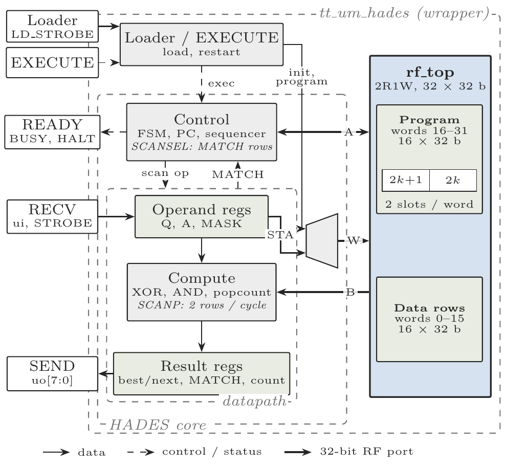

# HADES - Technical Documentation

## Overview

HADES is a small search engine for binary data. It holds 16 data rows of 32 bits each and compares them against a query using masked Hamming distance (the number of bit positions that differ, counting only the positions you choose). A short 16-bit instruction program, loaded by the host, tells the chip what to search for and what to send back.

The chip can do the following on the stored rows:

1. Nearest search: find the row closest to the query (and optionally the second closest).
2. Threshold search: find every row within a given distance of the query, as a 16-bit bitmap plus a count.
3. Exact match: find every row that equals the query.
4. Reductions: OR, AND or bit-count across rows.

The data rows and the program share one 32 x 32-bit register file macro (`rf_top`). Rows are searched right next to where they are stored, so only the small results (index, distance, bitmap, count) leave the chip.

## Architecture



> Figure 1: HADES architecture showing the wrapper, the core, the datapath and the `rf_top` memory.

HADES has four main parts.

### 1. Wrapper (`tt_um_hades`)
Connects the chip pins to the core. It contains the loader, which turns incoming bytes into 16-bit instructions and writes them into program memory, and the EXECUTE logic, which starts or restarts the program. After reset, it also fills the whole program area with HALT (this takes 16 clocks).

### 2. Control
A state machine with a 5-bit program counter (PC). It fetches an instruction, decodes it and starts the right action. It also drives the `READY`, `BUSY` and `HALT` outputs and runs the scan sequencing (which row to read next).

### 3. Datapath
- Operand registers: `Q` (the query), `A` (accumulator and threshold) and `MASK` (which bits count).
- Compute: XORs a row with `Q`, ANDs with `MASK`, then counts the set bits (popcount). This gives the Hamming distance.
- Result registers: best and second best distance and row index, the 16-bit `MATCH` bitmap, and the match `count`.

### 4. Memory (`rf_top`)
One register file with 32 words of 32 bits, two read ports and one write port.

| Words | Use |
|---|---|
| 0 to 15 | Data rows (one 32-bit row per word) |
| 16 to 31 | Program (two 16-bit instructions per word, 32 instructions in total) |

Read port A is used for instruction fetch. Read port B reads data rows for the compute unit. The write port takes writes from the loader (program) and from the `STA` instruction (data rows).

## Interface Specification

### Pin Assignment

| Pin | Direction | Function |
|---|---|---|
| `ui[7:0]` | Input | RECV data byte or loader byte |
| `uo[7:0]` | Output | SEND data (valid when READY is high) |
| `uio[0]` | Output | READY (a result byte is on `uo`) |
| `uio[1]` | Output | BUSY (program is running) |
| `uio[2]` | Output | HALT (program has stopped) |
| `uio[3]` | Input | STROBE (RECV data byte is valid) |
| `uio[4]` | Input | LD_STROBE (loader byte is valid, rising edge) |
| `uio[5]` | Input | EXECUTE (rising edge starts or restarts the program) |
| `uio[7:6]` | Unused | Not used |
| `clk` | Input | Clock |
| `rst_n` | Input | Active-low reset |

### Reset Behavior

On reset (`rst_n = 0`):
- All control state is cleared. BUSY, HALT and READY are 0.
- `MASK` is set to `0xFFFFFFFF`. The result registers go back to their start values (`best_val` and `next_val` = `0x3F`, indexes, `MATCH` and `count` = 0).
- `Q` and `A` are undefined.
- The program is erased. After `rst_n` is released, the chip writes HALT into all 32 program slots over 16 clocks. Loader bytes and EXECUTE are ignored during this time.
- The data rows are kept through reset.

## Using the Chip

1. Reset. Hold `rst_n` low, then release it. Wait at least 16 clocks.
2. Load the program. Put a byte on `ui[7:0]` and give `uio[4]` (LD_STROBE) a rising edge. Send each 16-bit instruction as two bytes, high byte first. Instructions go to slots 0, 1, 2 and so on. Unused slots stay HALT.
3. Start. Give `uio[5]` (EXECUTE) a rising edge. The program starts at instruction 0 about 2 clocks later.
4. Talk to the program.
   - For `RECV`, put a byte on `ui[7:0]` and raise `uio[3]` (STROBE).
   - For `SEND`, read `uo[7:0]` when `uio[0]` (READY) is high. READY is high for one clock only, so sample it in that clock.
5. Finish. When the program reaches `HALT`, BUSY goes low and HALT goes high.

Things to know:
- Another EXECUTE (while running or after HALT) restarts at instruction 0. It keeps `Q`, `A`, `MASK`, the results and the data rows.
- EXECUTE is ignored during reset and initialisation, while a loader byte pair is incomplete (high byte sent, low byte pending), and in the same clock as a loader byte. It is also ignored if `uio[5]` was already high when `rst_n` was released. A new rising edge is needed.
- Loading a program while it is executing is not supported.
- A reset erases the program.
- `RECV` waits forever until the host sends a byte (no timeout).
- There is no flow control between `SEND` and `RECV`. The host must read all `SEND` bytes of one pass before it sends `RECV` data for the next pass.

## Registers

| Register | Width | Description | On reset |
|---|---|---|---|
| `Q` | 32 b | Query to compare rows against | undefined |
| `A` | 32 b | Accumulator. `A[7:0]` is the threshold for `WITHIN` | undefined |
| `MASK` | 32 b | Bit = 0 means that bit is ignored in every scan | `0xFFFFFFFF` |
| `best_val` | 6 b | Best result of the last scan (0 to 32, `0x3F` = no row recorded) | `0x3F` |
| `best_idx` | 4 b | Row of the best result | 0 |
| `next_val` | 6 b | Second best result (only after `NEAREST2`, `0x3F` = none) | `0x3F` |
| `next_idx` | 4 b | Row of the second best result | 0 |
| `MATCH` | 16 b | Bit i is set when row i passed `WITHIN` or `EQUAL` | 0 |
| `count` | 5 b | Number of rows that set a `MATCH` bit (stops at 31) | 0 |
| `MIN_VALID` | 1 b | Set when a `NEAREST`, `NEAREST2`, `WITHIN` or `ARGMAX_POP` scan processed at least one row | 0 |
| `THRESHOLD_HIT` | 1 b | Set when a row was within the threshold during `WITHIN` | 0 |

For `NEAREST` and `WITHIN`, `best_val` is the smallest Hamming distance. For `ARGMAX_POP` it is the largest bit count.

## Instruction Set

Every instruction is 16 bits wide.

```
Bits   15 14 13 12 | 11 10  9  8 | 7  6  5  4 | 3  2  1  0
       ─────────── | ─────────── | ─────────── | ───────────
Field    opcode    |      A      |      B      |      C
```

Unused fields must be zero.

| Opcode | Instruction | A [11:8] | B [7:4] | C [3:0] | Cycles |
|---|---|---|---|---|---|
| `0x0` | `LDQ row` | row | - | - | 2 |
| `0x1` | `LDA row` | row | - | - | 2 |
| `0x2` | `LDM row` | row | - | - | 2 |
| `0x3` | `STA row` | row | - | - | 1 |
| `0x4` | `SCAN base, len, op, mode` | base | len - 1 | mode and op | len + 1 |
| `0x5` | `RECV dst, pos` | dst and pos | - | - | waits for host |
| `0x6` | `SEND src` | src | - | - | 1 |
| `0x7` | `BRANCH cond, offset` | cond | offset [7:4] | offset [3:0] | 1 |
| `0x8` | `HALT` | - | - | - | 1 |
| `0x9` | `UNMASK` | - | - | - | 1 |
| `0xA` | `SCANP base, len, op, mode` | base | len - 1 | mode and op | see below |
| `0xB` | `SCANSEL op, mode` | 0 | 0 | mode and op | 1 + k |
| `0xC` to `0xF` | Reserved | | | | |

### Load and store
- `LDQ row`, `LDA row`, `LDM row` copy data row `row` (0 to 15) into `Q`, `A` or `MASK`. They take 2 cycles, and the next instruction already sees the new value.
- `STA row` copies `A` into data row `row`. So `STA row` followed by `LDQ row` or `LDM row` moves `A` into `Q` or `MASK` without leaving the chip.
- `UNMASK` sets `MASK` back to `0xFFFFFFFF`.

### RECV
`RECV dst, pos` waits for one byte from the host and writes it into one byte lane of a register. Other lanes are unchanged.

```
dst (A[3:2]):  00 = Q    01 = A    10 = MASK    11 = reserved
pos (A[1:0]):  0 = [7:0]   1 = [15:8]   2 = [23:16]   3 = [31:24]
```

`RECV` is the other way (besides `LDx`) to set `Q`, `A` and `MASK`. A program that uses `SCAN WITHIN` must set `A[7:0]` (the threshold) first, because `A` is undefined after reset.

### SEND
`SEND src` puts one byte on `uo[7:0]` and pulses READY for one clock. The next instruction runs on the next clock, whether or not the host has read the byte.

| src | Name | Output byte |
|---|---|---|
| `0x0` | best_idx | `{0000, best_idx}` |
| `0x1` | best_val | `{00, best_val}` |
| `0x2` | A_byte0 | `A[7:0]` |
| `0x3` | A_byte1 | `A[15:8]` |
| `0x4` | A_byte2 | `A[23:16]` |
| `0x5` | A_byte3 | `A[31:24]` |
| `0x6` | match_lo | `MATCH[7:0]` |
| `0x7` | match_hi | `MATCH[15:8]` |
| `0x8` | count | `{000, count}` |
| `0x9` | flags | `{000000, THRESHOLD_HIT, MIN_VALID}` |
| `0xA` | next_idx | `{0000, next_idx}` |
| `0xB` | next_val | `{00, next_val}` |
| `0xC` to `0xF` | Reserved | undefined |

If no row was recorded, `best_val` and `next_val` read as `0x3F`.

### BRANCH
If the condition is true, `PC` becomes `(PC + 1) + offset`, where `offset` is a signed 8-bit number (-128 to +127).

| cond | Name | Taken when |
|---|---|---|
| `0x0` | ALWAYS | always |
| `0x1` | THRESHOLD_HIT | `THRESHOLD_HIT` = 1 |
| `0x2` | NOT_THRESH | `THRESHOLD_HIT` = 0 |
| `0x3` | MIN_VALID | `MIN_VALID` = 1 |
| `0x4` | COUNT_NZ | `count` is not 0 |
| `0x5` | MATCH_NZ | `MATCH` is not 0 |
| `0x6` | A_ZERO | `A` is 0 |
| `0x7` | A_NONZERO | `A` is not 0 |
| `0x8` to `0xF` | Reserved | do not use |

## Scan Operations

### SCAN
`SCAN base, len, op, mode` goes through rows `base` to `base + len - 1` (`len` is 1 to 16) and applies `op` to each row. Row reads and compute overlap, so a scan takes `len + 1` cycles. If the range goes past row 15, it stops at row 15 with no error.

In the instruction, field B holds `len - 1`, and field C holds `mode` in bit 3 and `op` in bits 2:0. The assembler takes the real `len`.

Mode
- INIT (bit 3 = 0): the result registers used by the op are first set to their start values, then the scan runs.
- ACC (bit 3 = 1): the scan continues from the current values. Use this to chain scans over several row ranges.

Ops. `d` is the masked Hamming distance of a row, `popcount((row XOR Q) AND MASK)`.

| op | Name | What it does |
|---|---|---|
| `000` | NEAREST | Keeps the smallest `d` in `best_val` and its row in `best_idx`. |
| `001` | NEAREST2 | Same as NEAREST, and also keeps the second smallest in `next_val` and `next_idx`. |
| `010` | WITHIN | Updates `best_val` and `best_idx` like NEAREST. Also, if `d <= A[7:0]`, sets that row's `MATCH` bit, adds 1 to `count` and sets `THRESHOLD_HIT`. |
| `011` | EQUAL | Sets the `MATCH` bit and adds to `count` for each row where `(row XOR Q) AND MASK` is 0. Does not change `best_val` or `best_idx`. |
| `100` | REDUCE_OR | `A = A OR (row AND MASK)` |
| `101` | REDUCE_AND | `A = A AND (row AND MASK)` |
| `110` | REDUCE_POP | `A = A + popcount(row AND MASK)` (at most 512) |
| `111` | ARGMAX_POP | Keeps the largest `popcount(row AND MASK)` in `best_val` and its row in `best_idx`. |

If two rows tie, the lower row wins.

Start values in INIT mode

| Register | NEAREST | NEAREST2 | WITHIN | EQUAL | REDUCE_OR | REDUCE_AND | REDUCE_POP | ARGMAX_POP |
|---|---|---|---|---|---|---|---|---|
| `best_val` | `0x3F` | `0x3F` | `0x3F` | - | - | - | - | 0 |
| `best_idx` | 0 | 0 | 0 | - | - | - | - | 0 |
| `next_val` | - | `0x3F` | - | - | - | - | - | - |
| `next_idx` | - | 0 | - | - | - | - | - | - |
| `A` | - | - | - | - | 0 | `0xFFFFFFFF` | 0 | - |
| `MATCH` | - | - | 0 | 0 | - | - | - | - |
| `count` | - | - | 0 | 0 | - | - | - | - |
| `MIN_VALID` | 0 | 0 | 0 | - | - | - | - | 0 |
| `THRESHOLD_HIT` | - | - | 0 | - | - | - | - | - |

A dash means the register is not touched by that op.

### SCANP (two rows per cycle)
`SCANP` has the same fields and the same result as `SCAN`. The only difference is speed. For `EQUAL`, `REDUCE_OR` and `REDUCE_AND` it reads two rows per cycle, so it takes `1 + ceil(n / 2)` cycles for `n` rows (a 16-row scan takes 9 cycles instead of 17). For all other ops it runs exactly like `SCAN`, because those need one popcount per row. `SCAN` and `SCANP` can be mixed in a chain.

### SCANSEL (scan only the matched rows)
`SCANSEL op, mode` works like `SCAN`, but it visits only the rows whose `MATCH` bit is set when the instruction starts. There is no `base` or `len`. Selected rows are visited from low to high, so with `k` selected rows it takes `1 + k` cycles (1 cycle if `MATCH` is 0, and nothing is read).

The selection is saved at the start. An INIT-mode `EQUAL` or `WITHIN` `SCANSEL` clears `MATCH` and `count` first and rebuilds them from the selected rows only, so `MATCH` can only get smaller. This lets a program narrow a result step by step (for example `EQUAL`, then `WITHIN` on those rows).

## Example Programs

These programs were tested on the chip:

| Program | Instructions |
|---|---|
| KNN Hamming search (streaming) | 7 |
| LSH exact bucket lookup (streaming) | 8 |
| Threshold search with bitmap | 11 |
| Masked binary neural network layer (streaming, threshold byte sent into `A` first) | 14 |
| Two-phase conditional search | 14 |
| Adaptive threshold search | 14 |
| Database density analytics (4 passes) | 17 |

The program memory holds 32 instructions.

## Testing and Verification

The cocotb tests in `test/` drive only the chip pins. They run at RTL and at gate level.

```
make sim              # RTL
make -B GATES=yes     # gate level
```

The test files cover:
- `test_isa.py`: each instruction.
- `test_scan.py`: the scan ops and modes.
- `test_scanp.py`: the two-rows-per-cycle scan.
- `test_scansel.py`: the scan over matched rows.
- `test_host.py`: the loader, EXECUTE, RECV and SEND protocol.
- `test_golden.py`: complete programs checked against a reference model (`hades_ref.py`).

## Design Notes

- Clock: the design is fully synchronous to one clock.
- Reset: `rst_n` resets all control state. The program area is refilled with HALT after reset.
- Memory: program and data share one `rf_top` register file, so a program can store `A` into a data row with `STA`.
